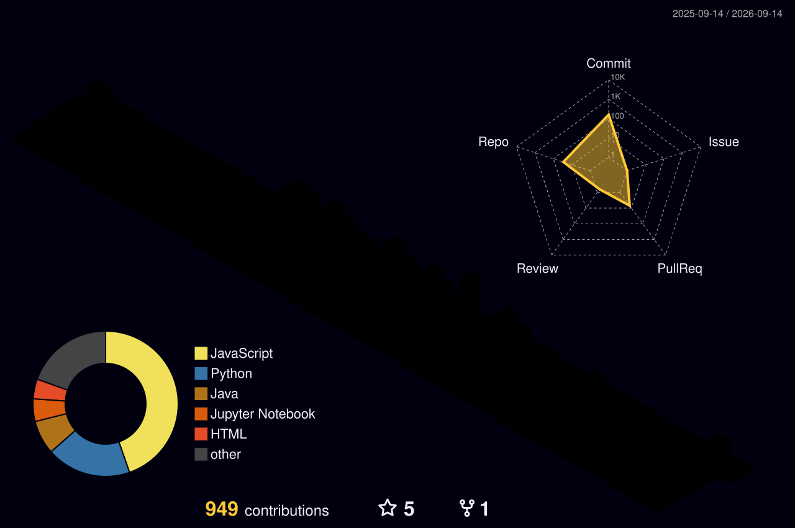

<!---- - 👋 Hi, I’m @AnkitKolhe149
- 👀 I’m interested in Competitive Programming and 3D Graphical Design.
- 🌱 I’m currently learning Computer Science with specialization in Artificial Intelligence & Machine  Learning.
- 📫 Reach out to me at www.nkolhe149@gmail.com
😄 Pronouns: ...
- ⚡ Fun fact: ...
- 💞️ I’m looking to collaborate on ...

AnkitKolhe149/AnkitKolhe149 is a ✨ special ✨ repository because its `README.md` (this file) appears on your GitHub profile.
You can click the Preview link to take a look at your changes.
--->
<h1 align="center">Hi 👋, I'm Ankit Kolhe</h1>
<h3 align="center"> 👀 I’m interested in Competitive Programming and Problem Solving  
- 🌱 I’m currently persuing Computer Science with specialization in Artificial Intelligence & Machine  Learning.</h3>

  

  

- 📫 Reach out to me at [nkolhe149@gmail.com](mailto:nkolhe149@gmail.com)

<h3 align="left">Connect with me:</h3>

<h3 align="left">Languages and Tools:</h3>

	<table>
		<tr>
			<td><code></code></td>
			<td><code></code></td>
			<td><code></code></td>
			<td><code></code></td>
			<td><code></code></td>
			<td><code></code></td>
			<td><code></code></td>
			<td><code></code></td>
		</tr>
		<tr>
			<td><code></code></td>
			<td><code></code></td>
			<td><code></code></td>
			<td><code></code></td>
			<td><code></code></td>
			<td><code></code></td>
			<td><code></code></td>
			<td><code></code></td>
		</tr>
		<tr>
			<td><code></code></td>
			<td><code></code></td>
			<td><code></code></td>
			<td><code></code></td>
			<td><code></code></td>
			<td><code></code></td>
			<td><code></code></td>
			<td><code></code></td>
		</tr>
		<tr>
			<td><code></code></td>
			<td><code></code></td>
			<td><code></code></td>
			<td><code></code></td>
			<td><code></code></td>
			<td><code></code></td>
			<td><code></code></td>
			<td><code></code></td>
		</tr>
		<tr>
			<td><code></code></td>
			<td><code></code></td>
			<td><code></code></td>
			<td><code></code></td>
			<td><code></code></td>
			<td><code></code></td>
			<td><code></code></td>
			<td><code></code></td>
		</tr>
	</table>

###

<!---/**/ --->

&nbsp;

    
    

